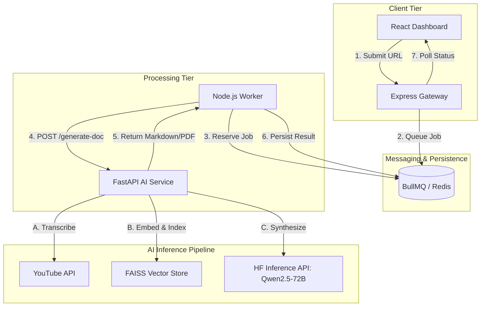
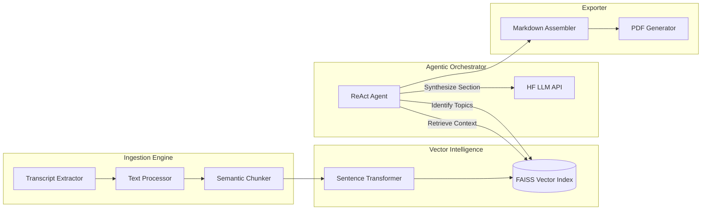

# 🌌 Vortex RAG: Agentic YouTube Intelligence Engine

Vortex RAG is a sophisticated, full-stack application designed to transform unstructured YouTube video content into structured, searchable, and professional intelligence reports. By leveraging a multi-tier microservice architecture and agentic RAG (Retrieval-Augmented Generation), Vortex provides a seamless pipeline for high-fidelity knowledge extraction.


---

## 🏗️ Technical Architecture

Vortex RAG follows a robust, asynchronous microservice architecture to ensure high performance and scalability.



---

## ✨ Strategic Features

- **Automated Intelligence Synthesis**: Converts raw transcripts into professional Markdown reports featuring executive summaries, thematic breakdowns, and key action items.
- **Asynchronous Resilience**: Managed by **BullMQ** and **Redis**, ensuring that long-running processing jobs never block the user interface.
- **Agentic RAG Pipeline**: Utilizes a ReAct-based agent to navigate the vector space of the transcript, ensuring high-accuracy synthesis without hallucination.
- **Cyber-Refined Dashboard**: A premium, glassmorphic UI built with **Tailwind v4** and **Framer Motion** for a smooth, high-contract visual experience.
- **Digital Asset Generation**: Automatically generates and serves high-quality PDF snapshots of extracted intelligence for offline viewing.
- **Privacy-First Purge**: Integrated job deletion functionality to securely clear metadata and results from the Intelligence Ledger.

---

## 🛠️ Engineering Stack

### **Frontend**
- **React 19 / Vite**: High-performance rendering and HMR.
- **Tailwind CSS v4**: Utility-first styling with native CSS variable integration.
- **Framer Motion**: Smooth entry/exit animations and state transitions.
- **Lucide React**: Modern, scalable iconography.

### **Gateway & Queue**
- **Node.js / Express**: Secure API gateway.
- **BullMQ**: Industrial-strength Redis-backed job queue.
- **ioredis**: High-performance Redis client for state persistence.

### **AI Microservice**
- **FastAPI**: Asynchronous Python web framework for LLM orchestration.
- **FAISS**: Local vector database for efficient semantic search.
- **huggingface_hub**: Serverless inference for **Qwen2.5-72B-Instruct**.
- **Sentence Transformers**: Local embedding generation for RAG chunks.

---

## 🧠 Deep Dive: AI Synthesis Microservice

The AI Service is a high-performance **FastAPI** application designed to handle the core RAG (Retrieval-Augmented Generation) pipeline. It orchestrates a multi-step **ReAct-style Agentic Workflow** to ensure high-fidelity document synthesis.

### AI Service Internal Flow



### The Agentic RAG Workflow
Vortex RAG does not simply "summarize" text. It follows a 5-step cognitive pipeline:

1.  **Topological Analysis**: The agent analyzes a 3,000-character overview of the transcript to identify the top **5 strategic topics**.
2.  **Semantic Retrieval**: For each identified topic, the agent performs a similarity search against the **FAISS** index to retrieve relevant context chunks.
3.  **Contextual Synthesis**: The agent calls the **Qwen2.5-72B** model with the retrieved context and a specific persona prompt to write a detailed, professional section.
4.  **Executive Distillation**: A separate pass is made to generate a high-level **Abstract** and a list of **6 Actionable Takeaways**.
5.  **Professional Post-Processing**: The components are assembled into valid Markdown and converted into a **PDF** via the `xhtml2pdf` engine.

---

## 🤖 AI-Assisted Development

This project was developed using modern **AI-assisted development workflows** to significantly accelerate prototyping, UI design, and complex RAG pipeline experimentation.

By utilizing agentic AI tools like **Antigravity by Google DeepMind**, we achieved rapid architectural iteration and high-aesthetic UI consistency. While AI assisted with parts of the implementation and boilerplate, the core system architecture, service integration, and critical engineering decisions—such as the transition to an asynchronous BullMQ queue and the custom FAISS vector indexing logic—were designed and implemented by the developer.

The resulting platform is a direct reflection of the synergy between developer-led architecture and AI-driven implementation speed.

---

## 🚀 Deployment Guide

### 1. Prerequisites
- **Docker** (Optional, for Redis)
- **Node.js v18+**
- **Python v3.10+**
- **HuggingFace Access Token** (Inference API)

### 2. Environment Configuration
Create `.env` files in both the `./Backend` and `./AI_service` directories:

| Variable | Description |
| :--- | :--- |
| `HF_TOKEN` | Your Hugging Face API Token |
| `REDIS_HOST` | Hostname of your Redis instance |
| `PORT` | Gateway port (Default: 3000) |
| `FASTAPI_URL` | AI Service endpoint (Default: http://localhost:8000) |

### 3. Service Initialization
**Launch AI Service:**
```bash
cd AI_service && pip install -r requirements.txt
uvicorn app:app --reload --port 8000
```

**Launch Gateway & Worker:**
```bash
cd Backend && npm install
node server.js & node worker.js
```

**Launch Frontend:**
```bash
cd Frontend && npm install
npm run dev
```

---

## 👤 Author 
**Vennilavan Manoharan**
- **GitHub**: [Vennilavan-Manoharan](https://github.com/Vennilavan-Manoharan)

---

## 📜 License
Distributed under the **MIT License**. See `LICENSE` for details.
